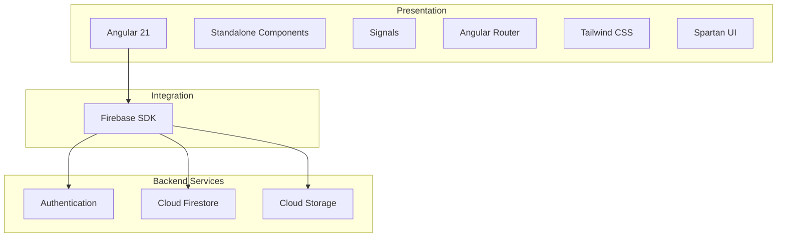
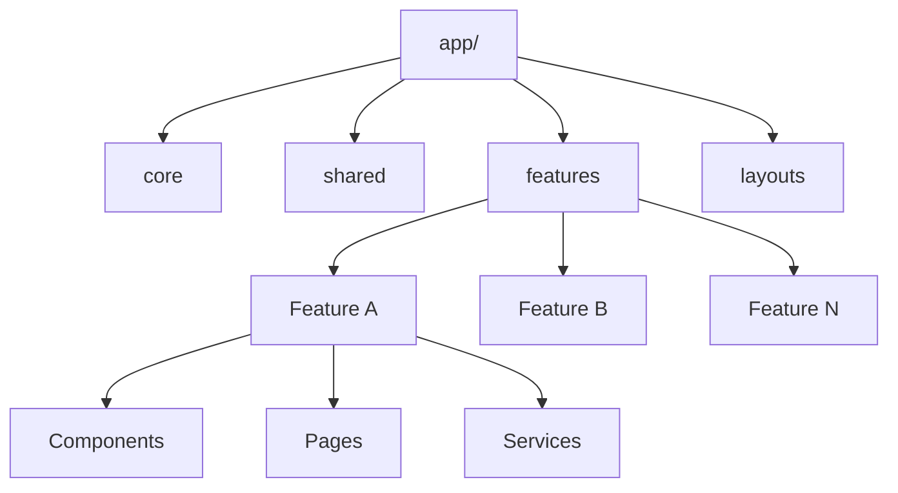
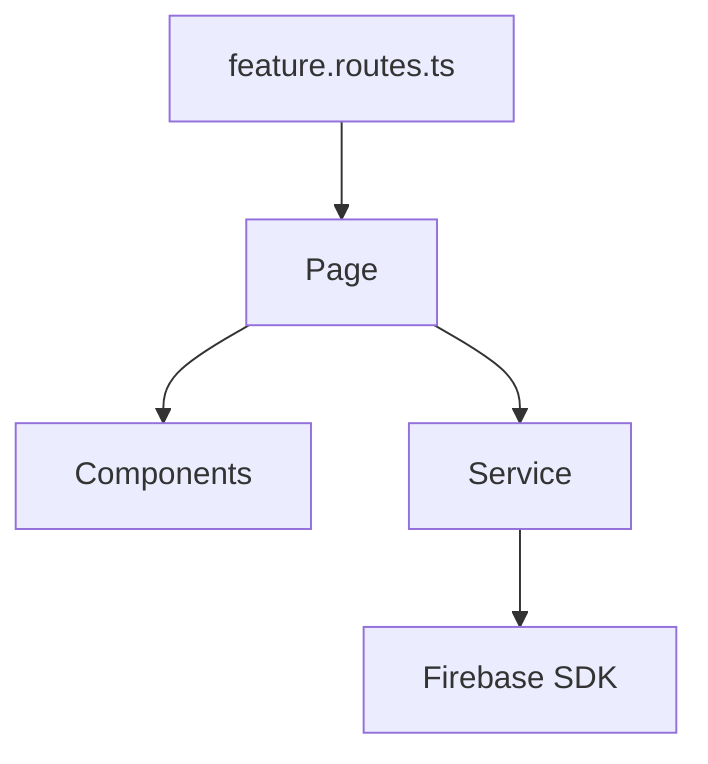
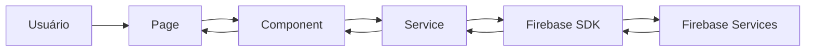
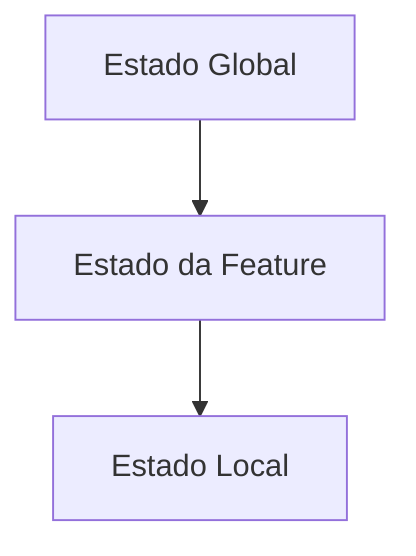
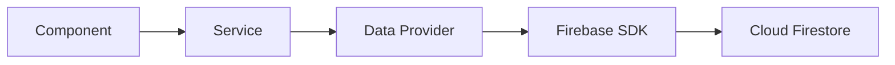
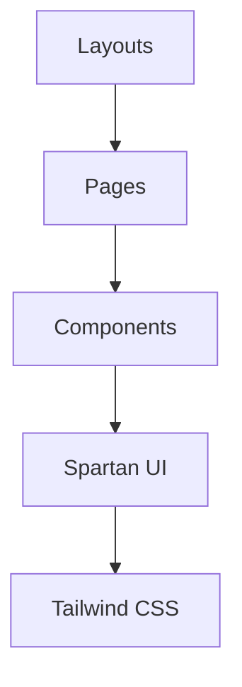

# 1. Introdução

Este documento apresenta a visão arquitetural inicial do projeto Firebase Starter, estabelecendo os princípios, objetivos e diretrizes que orientarão seu desenvolvimento.

O propósito desta arquitetura é fornecer uma visão de alto nível da solução, registrando as decisões estruturais já definidas e servindo como referência para a evolução do projeto.

Por se tratar da versão 1.0, este documento representa o estado atual da arquitetura e não pretende antecipar todas as decisões futuras. Novas tecnologias, padrões e estratégias poderão ser incorporados ao longo do desenvolvimento conforme surgirem novas necessidades ou oportunidades de melhoria.

As decisões arquiteturais específicas serão registradas individualmente por meio das Architecture Decision Records (ADRs), permitindo que este documento permaneça focado na visão geral da solução enquanto as ADRs documentam o contexto, as motivações e as consequências de cada decisão.

---

# 2. Visão do Projeto

O Firebase Starter é um projeto pessoal desenvolvido com o objetivo de revisar, atualizar e consolidar conhecimentos sobre o desenvolvimento de aplicações modernas utilizando Angular e o ecossistema Firebase.

O projeto servirá como um ambiente de experimentação prática, permitindo explorar recursos recentes do Angular, como Standalone Components e Signals, juntamente com os serviços oferecidos pelo Firebase SDK.

Além da implementação das funcionalidades, o projeto adota uma abordagem orientada por arquitetura, na qual decisões relevantes são documentadas antes ou durante sua implementação. Essa prática contribui para a organização do desenvolvimento, facilita futuras consultas e registra a evolução técnica do projeto ao longo do tempo.

Ao final do desenvolvimento, espera-se obter uma aplicação funcional construída sobre uma arquitetura moderna, organizada e escalável, que também possa servir como base para projetos futuros com características semelhantes.

---

# 3. Objetivos Arquiteturais

A arquitetura do Firebase Starter foi concebida para priorizar simplicidade, organização e facilidade de evolução. As decisões adotadas buscam equilibrar boas práticas de engenharia de software com a utilização dos recursos mais atuais disponíveis no ecossistema Angular.

Os principais objetivos arquiteturais são:

* construir uma base sólida para aplicações Angular integradas ao Firebase;
* manter uma organização baseada em funcionalidades (Feature-Based Architecture);
* favorecer baixo acoplamento e alta coesão entre os componentes da aplicação;
* utilizar recursos modernos do Angular sempre que apropriado;
* facilitar a manutenção e a evolução do código;
* incentivar a reutilização de componentes e serviços;
* manter uma estrutura consistente desde o início do desenvolvimento;
* documentar as principais decisões arquiteturais por meio de ADRs;
* permitir que a arquitetura evolua de forma incremental, acompanhando o crescimento do projeto.

Esses objetivos servirão como critérios para avaliar futuras decisões arquiteturais, garantindo que novas implementações permaneçam alinhadas com a visão estabelecida neste documento.

--- 
# 4. Escopo

A versão inicial da arquitetura contempla a estrutura necessária para o desenvolvimento de uma aplicação Angular integrada ao Firebase utilizando uma abordagem moderna e orientada por funcionalidades.

Nesta fase, fazem parte do escopo arquitetural:

* organização do projeto baseada em Features;
* utilização de Standalone Components;
* gerenciamento de estado utilizando Angular Signals, quando apropriado;
* integração com os principais serviços do Firebase SDK;
* construção de interfaces responsivas com Tailwind CSS e Spartan UI;
* organização do código em camadas com responsabilidades bem definidas;
* adoção de práticas voltadas para escalabilidade, manutenção e legibilidade.

Não fazem parte do escopo desta versão decisões específicas de implementação, regras de negócio da aplicação ou otimizações voltadas para cenários particulares. Esses aspectos serão documentados posteriormente, conforme forem definidos durante o desenvolvimento do projeto, seja por meio de novas versões desta arquitetura ou pela criação de ADRs específicas.

----

# 5. Visão Geral da Solução

O Firebase Starter adota uma arquitetura cliente-servidor baseada no ecossistema Angular e nos serviços gerenciados do Firebase.

A aplicação é composta por um frontend desenvolvido em Angular, responsável pela interface do usuário, gerenciamento da navegação e execução das regras de apresentação, enquanto o Firebase fornece a infraestrutura necessária para autenticação, persistência de dados e armazenamento de arquivos.

A comunicação entre a aplicação e os serviços do Firebase ocorre por meio do Firebase SDK, eliminando a necessidade de uma API intermediária nesta primeira versão da arquitetura. Essa abordagem reduz a complexidade inicial da solução, acelera o desenvolvimento e permite concentrar o estudo nas tecnologias que compõem o ecossistema Angular moderno.

A arquitetura foi concebida para manter uma separação clara entre a interface, a lógica da aplicação e o acesso aos serviços externos. Essa organização favorece a manutenção do código, facilita a evolução das funcionalidades e reduz o acoplamento entre os diferentes elementos do sistema.

Embora a primeira versão utilize exclusivamente os serviços disponibilizados pelo Firebase, a arquitetura procura preservar uma estrutura suficientemente organizada para permitir futuras evoluções, como a substituição de serviços, a inclusão de um backend próprio ou a integração com outras plataformas, caso essas necessidades surjam durante a evolução do projeto.

De forma simplificada, a solução pode ser representada pela seguinte arquitetura de alto nível:

```text
                    Usuário
                        │
                        ▼
        ┌─────────────────────────────┐
        │       Angular 21            │
        │  Standalone Components      │
        │        Signals              │
        │      Feature-Based          │
        └──────────────┬──────────────┘
                       │
                 Firebase SDK
                       │
        ┌──────────────┼──────────────┐
        ▼              ▼              ▼
 Authentication     Firestore      Storage
```

Nesta arquitetura, o Angular concentra toda a experiência da aplicação, enquanto o Firebase fornece os serviços de infraestrutura consumidos diretamente pelo cliente. Essa divisão de responsabilidades mantém a solução simples, moderna e adequada aos objetivos definidos para a versão inicial do projeto.

---
## 6. Arquitetura de Alto Nível

A arquitetura do Firebase Starter é organizada em camadas com responsabilidades bem definidas, promovendo baixo acoplamento entre os componentes da aplicação e facilitando sua evolução ao longo do desenvolvimento.

Embora o projeto utilize uma arquitetura cliente-servidor simplificada, sua estrutura interna foi planejada para separar claramente a interface do usuário, a lógica da aplicação e o acesso aos serviços externos. Essa organização permite que alterações em uma camada tenham impacto mínimo sobre as demais.

Em alto nível, a solução é composta pelos seguintes blocos arquiteturais:

### Interface do Usuário (Presentation)

Responsável pela interação com o usuário, renderização das telas e navegação da aplicação. Esta camada concentra páginas, componentes visuais e layouts, utilizando os recursos modernos do Angular para construir interfaces reativas e responsivas.

---

### Camada de Aplicação (Application)

Centraliza a lógica responsável por coordenar o comportamento da aplicação. Nesta camada encontram-se os serviços responsáveis pela comunicação entre a interface e a infraestrutura, encapsulando regras de fluxo, autenticação, acesso aos dados e demais funcionalidades compartilhadas.

---

### Infraestrutura (Infrastructure)

Representa a integração com os serviços externos utilizados pela aplicação. Na versão inicial do projeto, essa camada é composta pelo Firebase SDK e pelos principais serviços disponibilizados pela plataforma, como Authentication, Firestore e Cloud Storage.

Ao concentrar o acesso ao Firebase nesta camada, reduz-se o acoplamento entre as funcionalidades da aplicação e a tecnologia utilizada para persistência e autenticação.

---

### Plataforma (Platform)

Corresponde ao ambiente de execução da aplicação, formado pelo navegador e pelos serviços gerenciados do Firebase. Essa camada fornece a infraestrutura necessária para execução do sistema, autenticação dos usuários, armazenamento dos dados e hospedagem dos recursos utilizados pela aplicação.

---

A interação entre essas camadas ocorre de maneira unidirecional, preservando uma separação clara de responsabilidades.

```text
                    Usuário
                        │
                        ▼
┌──────────────────────────────────────────────┐
│          Interface do Usuário                │
│      Pages • Components • Layouts            │
└───────────────────┬──────────────────────────┘
                    │
                    ▼
┌──────────────────────────────────────────────┐
│          Camada de Aplicação                 │
│    Services • Guards • Estado • Regras       │
└───────────────────┬──────────────────────────┘
                    │
                    ▼
┌──────────────────────────────────────────────┐
│            Infraestrutura                    │
│ Firebase SDK • Auth • Firestore • Storage    │
└───────────────────┬──────────────────────────┘
                    │
                    ▼
┌──────────────────────────────────────────────┐
│               Plataforma                     │
│      Navegador + Serviços Firebase           │
└──────────────────────────────────────────────┘
```

Essa divisão em camadas estabelece uma base arquitetural simples e organizada, adequada aos objetivos do projeto e suficientemente flexível para acomodar futuras evoluções sem comprometer a estrutura existente.

É importante destacar que essa arquitetura representa uma visão lógica da solução. A organização física do código, a estrutura baseada em funcionalidades (Feature-Based Architecture) e a distribuição dos arquivos serão apresentadas nas seções seguintes deste documento.

---

## 7. Stack Tecnológica

O Firebase Starter utiliza tecnologias consolidadas no ecossistema Angular, priorizando ferramentas oficiais ou amplamente adotadas pela comunidade. A escolha dessa stack busca reduzir a complexidade da infraestrutura, favorecer a produtividade durante o desenvolvimento e permitir o estudo das práticas recomendadas para aplicações modernas.

Cada tecnologia foi selecionada para atender a uma responsabilidade específica dentro da arquitetura da solução.

| Tecnologia                  | Função na Arquitetura                                                  |
| --------------------------- | ---------------------------------------------------------------------- |
| **Angular 21**              | Framework principal para desenvolvimento da aplicação.                 |
| **TypeScript**              | Linguagem utilizada para implementação do projeto.                     |
| **Angular Signals**         | Gerenciamento reativo de estado local e comunicação entre componentes. |
| **Standalone Components**   | Estrutura moderna para organização dos componentes da aplicação.       |
| **Angular Router**          | Gerenciamento das rotas e navegação entre funcionalidades.             |
| **Firebase SDK**            | Camada de integração entre a aplicação e os serviços do Firebase.      |
| **Firebase Authentication** | Autenticação e gerenciamento de usuários.                              |
| **Cloud Firestore**         | Persistência de dados em banco NoSQL.                                  |
| **Cloud Storage**           | Armazenamento de arquivos da aplicação.                                |
| **Tailwind CSS**            | Sistema utilitário para estilização da interface.                      |
| **Spartan UI**              | Biblioteca de componentes baseada em Tailwind e Angular.               |
| **ESLint**                  | Análise estática e padronização do código.                             |
| **Prettier**                | Formatação automática do código-fonte.                                 |
| **Git**                     | Controle de versão do projeto.                                         |
| **GitHub**                  | Hospedagem do repositório e versionamento colaborativo.                |

A distribuição dessas tecnologias dentro da arquitetura pode ser representada pela seguinte visão em camadas:



A adoção dessa stack tecnológica está alinhada aos objetivos arquiteturais definidos neste documento, privilegiando simplicidade, organização e facilidade de evolução. Sempre que possível, serão utilizados recursos oficiais do Angular e do Firebase, reduzindo dependências desnecessárias e mantendo a aplicação próxima das práticas recomendadas pelos mantenedores das plataformas.

Novas tecnologias poderão ser incorporadas ao projeto conforme sua evolução justificar essa necessidade. Sempre que uma nova ferramenta impactar a arquitetura da solução, sua adoção será registrada por meio de uma ADR específica.

---

## 8. Organização do Projeto

A organização do Firebase Starter segue uma arquitetura baseada em funcionalidades (*Feature-Based Architecture*), na qual o código é estruturado de acordo com os domínios da aplicação, e não pelo tipo de artefato.

Essa abordagem busca manter funcionalidades relacionadas próximas entre si, facilitando a navegação pelo projeto, reduzindo dependências entre módulos e tornando a evolução da aplicação mais previsível à medida que novas funcionalidades são adicionadas.

Além das funcionalidades, a arquitetura define áreas responsáveis por recursos compartilhados e serviços globais da aplicação. Essa separação permite que cada parte do sistema possua uma responsabilidade bem definida, contribuindo para um código mais organizado e de fácil manutenção.

A estrutura inicial do projeto é representada da seguinte forma:

```text
src/
├── app/
│   ├── core/
│   ├── shared/
│   ├── features/
│   ├── layouts/
│   ├── app.config.ts
│   └── app.routes.ts
│
└── styles/
```

Cada diretório possui uma responsabilidade específica dentro da arquitetura.

| Diretório         | Responsabilidade                                                                                                                                                   |
| ----------------- | ------------------------------------------------------------------------------------------------------------------------------------------------------------------ |
| **core/**         | Recursos globais da aplicação, como serviços de infraestrutura, autenticação, configurações, interceptadores, guards e integrações utilizadas em toda a aplicação. |
| **shared/**       | Componentes reutilizáveis, diretivas, pipes, utilitários, modelos e demais recursos compartilhados entre diferentes funcionalidades.                               |
| **features/**     | Funcionalidades da aplicação organizadas por domínio de negócio. Cada feature mantém seus próprios componentes, páginas, serviços e recursos internos.             |
| **layouts/**      | Estruturas visuais responsáveis pela composição das páginas, como layouts públicos e autenticados.                                                                                                |
| **styles/**       | Arquivos globais de estilos e personalizações da aplicação.                                                                                                        |

A relação entre esses diretórios pode ser representada pela seguinte visão arquitetural:



A principal característica dessa organização é que as funcionalidades evoluem de forma independente. Sempre que uma nova feature for criada, sua estrutura permanecerá concentrada em um único local, reduzindo a necessidade de distribuir arquivos por diversos diretórios da aplicação.

Recursos de uso global permanecem centralizados em **core** e **shared**, evitando duplicação de código e promovendo reutilização entre as diferentes funcionalidades.

A estrutura apresentada representa a organização inicial do projeto e poderá evoluir conforme novas necessidades arquiteturais surgirem. Alterações que impactem significativamente essa organização deverão ser registradas por meio de ADRs, preservando o histórico das decisões adotadas.

---

## 9. Convenções Arquiteturais

Além da organização física do projeto, o Firebase Starter estabelece um conjunto de convenções arquiteturais destinadas a manter a consistência do código ao longo de sua evolução.

Essas convenções não têm como objetivo limitar a implementação das funcionalidades, mas fornecer diretrizes que favoreçam legibilidade, previsibilidade e facilidade de manutenção. Sempre que possível, serão adotadas as convenções recomendadas pelo Angular, complementadas por padrões específicos definidos para este projeto.

### Organização por responsabilidade

Cada artefato deve possuir uma única responsabilidade bem definida. Componentes são responsáveis pela apresentação da interface, serviços concentram a lógica de aplicação e integrações, enquanto modelos e utilitários permanecem desacoplados das regras de negócio.

---

### Organização por funcionalidades

Novas funcionalidades deverão ser criadas dentro do diretório `features`, mantendo todos os arquivos relacionados próximos entre si.

Uma feature deve ser capaz de evoluir de forma independente, reduzindo dependências com outras partes da aplicação.

---

### Compartilhamento de código

Recursos utilizados exclusivamente por uma funcionalidade devem permanecer dentro da própria feature.

Somente componentes, serviços ou utilitários reutilizados por diferentes funcionalidades deverão ser promovidos para o diretório `shared`.

Recursos de infraestrutura e serviços globais permanecem centralizados no diretório `core`.

---

### Convenções de nomenclatura

A nomenclatura dos arquivos seguirá o padrão recomendado pelo Angular, facilitando sua identificação e localização.

Alguns exemplos:

| Artefato   | Exemplo                       |
| ---------- | ----------------------------- |
| Componente | `user-card.component.ts`      |
| Página     | `login.page.ts`               |
| Serviço    | `auth.service.ts`             |
| Guard      | `auth.guard.ts`               |
| Modelo     | `user.model.ts`               |
| Interface  | `login-response.interface.ts` |
| Pipe       | `currency.pipe.ts`            |
| Diretiva   | `autofocus.directive.ts`      |

---

### Componentes

Os componentes devem possuir responsabilidade única e representar partes reutilizáveis da interface.

Sempre que uma página crescer excessivamente, ela deverá ser decomposta em componentes menores e especializados.

---

### Serviços

Serviços representam a camada responsável pela lógica da aplicação e pela comunicação com serviços externos.

Sempre que possível, componentes não devem acessar diretamente o Firebase SDK, delegando essa responsabilidade aos serviços.

---

### Gerenciamento de estado

O gerenciamento de estado seguirá a estratégia definida pela arquitetura do projeto, priorizando recursos nativos do Angular.

A utilização de Signals, serviços e demais mecanismos será detalhada em seções específicas desta arquitetura e nas ADRs correspondentes.

---

### Evolução das convenções

As convenções apresentadas nesta seção representam o conjunto inicial de diretrizes adotadas pelo projeto.

Novas convenções poderão ser incorporadas conforme a arquitetura evoluir, desde que contribuam para manter a consistência do código e estejam alinhadas aos objetivos arquiteturais definidos neste documento.

---

## 10. Estrutura das Features

As funcionalidades da aplicação são organizadas utilizando uma **Feature-Based Architecture**, na qual cada feature representa um domínio funcional da aplicação e concentra todos os artefatos necessários para sua implementação.

Essa abordagem busca manter alta coesão entre arquivos relacionados e reduzir o acoplamento entre diferentes partes do sistema. Em vez de distribuir componentes, serviços e modelos em diretórios globais, cada funcionalidade mantém sua própria organização interna.

Cada feature deve ser tratada como uma unidade independente de evolução. Sempre que possível, alterações realizadas em uma funcionalidade não devem exigir modificações em outras features da aplicação.

Na versão inicial da arquitetura, uma feature possui a seguinte estrutura conceitual:

```text
feature/
├── components/
├── pages/
├── services/
└── feature.routes.ts
```

Cada elemento possui uma responsabilidade específica.

| Elemento              | Responsabilidade                                                                 |
| --------------------- | -------------------------------------------------------------------------------- |
| **components/**       | Componentes reutilizáveis utilizados exclusivamente pela feature.                |
| **pages/**            | Componentes responsáveis pelas páginas e rotas da funcionalidade.                |
| **services/**         | Serviços responsáveis pela lógica da feature e comunicação com a infraestrutura. |
| **feature.routes.ts** | Definição das rotas pertencentes à funcionalidade.                               |

Essa organização representa apenas a estrutura mínima necessária para iniciar o desenvolvimento. Novos diretórios poderão ser incorporados quando houver necessidade justificada, evitando criar uma estrutura excessivamente complexa antes que ela seja realmente necessária.

O relacionamento entre os elementos internos de uma feature pode ser representado pela seguinte visão simplificada:



As dependências devem ocorrer sempre em um único sentido: as páginas coordenam a interface da funcionalidade, utilizam componentes para composição visual e delegam aos serviços a comunicação com a camada de infraestrutura.

Componentes não devem acessar diretamente os serviços do Firebase nem conter regras de negócio complexas. Da mesma forma, serviços não devem possuir responsabilidades relacionadas à renderização da interface. Essa separação mantém a arquitetura consistente e facilita a evolução independente de cada camada.

À medida que o projeto evoluir, novas convenções poderão ser estabelecidas para a organização interna das features. Sempre que essas alterações representarem uma decisão arquitetural relevante, elas serão registradas por meio de ADRs ou incorporadas em futuras versões deste documento.

--- 
## 11. Fluxo Geral da Aplicação

O Firebase Starter adota um fluxo de execução unidirecional, no qual cada camada da aplicação possui responsabilidades bem definidas. Essa abordagem facilita o entendimento do código, reduz dependências desnecessárias e torna o comportamento da aplicação mais previsível.

De forma geral, toda interação inicia na interface do usuário e percorre as camadas da aplicação até alcançar os serviços disponibilizados pelo Firebase. Após o processamento da operação solicitada, os dados retornam pelo mesmo caminho até serem refletidos na interface.

Esse fluxo evita que componentes realizem acesso direto à infraestrutura, concentrando a comunicação com serviços externos na camada de aplicação.

O fluxo básico pode ser representado da seguinte forma:



A responsabilidade de cada elemento é resumida a seguir:

| Elemento              | Responsabilidade                                                          |
| --------------------- | ------------------------------------------------------------------------- |
| **Page**              | Coordena a funcionalidade e a navegação da tela.                          |
| **Component**         | Apresenta informações ao usuário e captura eventos da interface.          |
| **Service**           | Implementa a lógica da funcionalidade e comunica-se com a infraestrutura. |
| **Firebase SDK**      | Intermedia a comunicação entre a aplicação e os serviços do Firebase.     |
| **Firebase Services** | Executam autenticação, persistência de dados e armazenamento de arquivos. |

Essa separação favorece a reutilização de código, simplifica testes e reduz o impacto de alterações futuras na infraestrutura da aplicação.

---

## 12. Estratégia de Estado

O gerenciamento de estado da aplicação prioriza os recursos nativos disponibilizados pelo Angular, evitando a introdução de bibliotecas externas enquanto sua utilização não se mostrar necessária.

A estratégia adotada baseia-se principalmente na utilização de **Signals**, que oferecem um modelo reativo simples, previsível e integrado ao framework.

Cada funcionalidade é responsável pelo gerenciamento do seu próprio estado, mantendo os dados próximos do domínio ao qual pertencem. Essa abordagem reduz o compartilhamento desnecessário de informações e favorece a independência entre as diferentes features da aplicação.

A arquitetura procura distinguir claramente três responsabilidades:

* **Estado Local** — informações utilizadas exclusivamente por um componente.
* **Estado da Feature** — informações compartilhadas entre elementos de uma mesma funcionalidade.
* **Estado Global** — informações utilizadas por toda a aplicação, como autenticação ou preferências do usuário.

Essa organização pode ser representada pela seguinte visão:



Sempre que possível, o estado deverá permanecer no menor escopo necessário. Informações utilizadas apenas por um componente não devem ser promovidas para um serviço compartilhado, assim como estados específicos de uma feature não devem ser tratados como globais sem necessidade.

A comunicação com o Firebase permanece sob responsabilidade dos serviços da aplicação. Os Signals atuam como mecanismo de sincronização entre esses serviços e a interface, permitindo que alterações de estado sejam refletidas automaticamente nos componentes consumidores.

Essa estratégia reduz a complexidade da arquitetura, elimina a necessidade de soluções mais robustas para gerenciamento de estado em cenários simples e acompanha a evolução recomendada pelo ecossistema Angular. Caso o crescimento da aplicação justifique novas abordagens, essas decisões serão avaliadas e registradas por meio de ADRs específicas.

--- 

## 13. Estratégia de Dados

A arquitetura do Firebase Starter foi concebida para desacoplar a aplicação da tecnologia responsável pela persistência dos dados.

Embora a versão inicial utilize o Cloud Firestore como principal mecanismo de armazenamento, a camada de aplicação não deve depender diretamente de APIs específicas do Firebase. Essa decisão busca preservar a flexibilidade da arquitetura e facilitar futuras evoluções da infraestrutura.

Para atingir esse objetivo, o acesso aos dados é centralizado em uma camada responsável por abstrair a origem das informações. Os serviços da aplicação consomem essa abstração sem conhecer detalhes da implementação utilizada para persistência.

A arquitetura lógica pode ser representada da seguinte forma:



Essa organização estabelece uma separação clara entre a lógica da aplicação e a infraestrutura de persistência.

### Data Providers

Os **Data Providers** representam a camada responsável pela comunicação com a origem dos dados.

Na versão inicial do projeto, essa responsabilidade será desempenhada por implementações baseadas no Firebase SDK. Entretanto, a aplicação permanecerá preparada para que novas implementações possam ser incorporadas sem alterar a lógica das funcionalidades.

Exemplos de possíveis implementações futuras incluem:

* Firebase Firestore
* API REST
* GraphQL
* Backend próprio
* Banco de dados local
* Mecanismos híbridos de sincronização

Essa abordagem permite que a tecnologia de persistência evolua independentemente da aplicação.

---

### Modelos de Domínio

Os modelos utilizados pela aplicação representam entidades do domínio e não documentos específicos do Firestore.

Sempre que necessário, o processo de conversão entre documentos persistidos e objetos da aplicação será realizado pelos Data Providers, evitando que detalhes da infraestrutura se propaguem pelas demais camadas.

Esse desacoplamento reduz o impacto de alterações futuras no modelo de armazenamento.

---

### Responsabilidades

A estratégia de dados define responsabilidades bem delimitadas entre as camadas da aplicação.

| Camada             | Responsabilidade                                                       |
| ------------------ | ---------------------------------------------------------------------- |
| **Componentes**    | Exibir informações e capturar interações do usuário.                   |
| **Serviços**       | Implementar regras da funcionalidade e coordenar operações de negócio. |
| **Data Providers** | Realizar operações de persistência e recuperação de dados.             |
| **Infraestrutura** | Implementar a comunicação com a tecnologia de armazenamento utilizada. |

Essa divisão impede que componentes ou serviços conheçam detalhes específicos da tecnologia de persistência.

---

### Evolução da Arquitetura

Embora o Firebase seja a plataforma escolhida para esta versão do projeto, a arquitetura não considera essa decisão como permanente.

Caso surja a necessidade de utilizar um backend próprio, expor APIs REST, adotar GraphQL ou integrar novos serviços de persistência, espera-se que a maior parte da aplicação permaneça inalterada. As modificações deverão concentrar-se na camada de infraestrutura e nos respectivos Data Providers, preservando os contratos utilizados pelas funcionalidades da aplicação.

Essa estratégia reduz o acoplamento entre a lógica de negócio e a infraestrutura, contribuindo para uma arquitetura mais flexível, sustentável e preparada para evoluções futuras.

---

## 14. Estratégia de Interface

A interface do Firebase Starter é concebida como uma camada independente da lógica da aplicação, responsável exclusivamente pela experiência do usuário, apresentação dos dados e captura das interações realizadas durante o uso do sistema.

Sua construção segue os princípios de componentização, reutilização e composição, priorizando interfaces simples, consistentes e adaptáveis aos diferentes dispositivos.

A arquitetura da interface é baseada na combinação entre Angular, Tailwind CSS e Spartan UI, permitindo unir a flexibilidade dos componentes Standalone com um sistema visual moderno e altamente personalizável.

### Arquitetura da Interface

A interface é organizada em diferentes níveis de responsabilidade.



Cada camada possui uma finalidade específica.

| Camada           | Responsabilidade                                                   |
| ---------------- | ------------------------------------------------------------------ |
| **Layouts**      | Estruturam a navegação e definem a composição geral das páginas.   |
| **Pages**        | Representam as telas da aplicação e coordenam cada funcionalidade. |
| **Components**   | Encapsulam partes reutilizáveis da interface.                      |
| **Spartan UI**   | Fornece componentes base reutilizáveis e acessíveis.               |
| **Tailwind CSS** | Responsável pela estilização e construção do sistema visual.       |

---

### Componentização

Os componentes representam a menor unidade reutilizável da interface.

Sempre que uma funcionalidade apresentar elementos reutilizáveis ou de responsabilidade específica, estes deverão ser extraídos para componentes independentes, favorecendo reutilização e reduzindo duplicação de código.

Componentes devem concentrar apenas responsabilidades relacionadas à apresentação e interação do usuário, evitando incorporar regras de negócio ou lógica de acesso a dados.

---

### Mobile First

A interface será desenvolvida seguindo a abordagem **Mobile First**, considerando dispositivos móveis como ponto de partida para o desenvolvimento das telas.

Layouts, espaçamentos e componentes serão inicialmente projetados para telas menores, expandindo progressivamente sua estrutura para tablets e desktops por meio dos recursos responsivos disponibilizados pelo Tailwind CSS.

Essa estratégia favorece desempenho, simplicidade da interface e melhor experiência em diferentes tamanhos de tela.

---

### Consistência Visual

A consistência visual da aplicação será obtida por meio da reutilização de componentes, da padronização dos estilos e da utilização dos recursos oferecidos pelo Spartan UI.

Sempre que possível, novos componentes deverão ser construídos a partir dos componentes-base existentes, preservando identidade visual, acessibilidade e comportamento consistente em toda a aplicação.

Customizações visuais deverão ocorrer preferencialmente através do Tailwind CSS, evitando alterações diretas na estrutura dos componentes da biblioteca.

---

### Separação entre Interface e Aplicação

A camada de interface não deve possuir dependência direta dos mecanismos de persistência de dados nem implementar regras de negócio.

As páginas e componentes comunicam-se exclusivamente com os serviços da aplicação, mantendo a infraestrutura desacoplada da apresentação.

Essa separação contribui para maior reutilização dos componentes, simplifica testes e facilita futuras evoluções da arquitetura.

---

### Evolução da Interface

A estratégia apresentada estabelece as diretrizes iniciais para construção da interface do Firebase Starter.

Novos componentes, layouts e padrões visuais poderão ser incorporados durante a evolução do projeto, preservando os princípios de reutilização, consistência e simplicidade definidos nesta arquitetura.

Sempre que alterações impactarem significativamente a organização ou a estratégia da interface, essas decisões serão registradas por meio de ADRs específicas.

## 15. Atributos de Qualidade Arquitetural

### 15.1 Segurança

A segurança constitui um dos pilares arquiteturais do Firebase Starter e deve estar presente em todas as camadas da aplicação. Sua arquitetura busca adotar práticas compatíveis com aplicações utilizadas em ambientes reais.

A estratégia de segurança fundamenta-se no princípio do **menor privilégio**, permitindo que usuários e componentes tenham acesso apenas aos recursos estritamente necessários para desempenhar suas funções.

#### Autenticação

A autenticação será realizada utilizando o Firebase Authentication, responsável pela identificação dos usuários e emissão das credenciais necessárias para acesso aos serviços da aplicação.

A arquitetura foi projetada para que os mecanismos de autenticação permaneçam concentrados na camada de infraestrutura, evitando que componentes da interface manipulem diretamente credenciais ou informações sensíveis.

---

#### Autorização

O controle de acesso aos recursos será realizado por meio das regras de segurança do Firebase e pelas políticas definidas na aplicação.

A interface poderá ocultar funcionalidades indisponíveis para determinados perfis de usuário, porém a proteção efetiva dos dados deverá ocorrer sempre na camada de persistência, impedindo acessos não autorizados mesmo diante de tentativas de manipulação do cliente.

---

#### Proteção de Dados

A arquitetura procura minimizar a exposição de informações sensíveis durante todo o fluxo da aplicação.

Dados de autenticação, identificadores internos e demais informações críticas não deverão ser armazenados desnecessariamente na interface nem compartilhados entre componentes sem justificativa funcional.

Sempre que possível, apenas os dados necessários para a execução da funcionalidade deverão permanecer em memória.

---

#### Comunicação Segura

Toda comunicação entre a aplicação e os serviços do Firebase ocorre utilizando conexões seguras providas pela própria plataforma.

A camada de aplicação permanece responsável apenas pela utilização dessas interfaces, sem necessidade de implementar mecanismos adicionais de transporte seguro.

---

#### Evolução da Segurança

À medida que o projeto evoluir, novos mecanismos poderão ser incorporados, como controle de permissões por papéis, autenticação multifator, auditoria de operações e integração com provedores externos de identidade.

Essas evoluções deverão preservar o princípio de separação entre regras de negócio, autenticação e infraestrutura, mantendo a arquitetura consistente e preparada para novos requisitos de segurança.

### 15.2 Performance

A arquitetura do Firebase Starter foi projetada para oferecer uma experiência fluida ao usuário, utilizando recursos modernos do Angular e do ecossistema Firebase para reduzir o consumo de recursos e otimizar o tempo de resposta da aplicação.

As estratégias adotadas priorizam simplicidade, eficiência e escalabilidade, evitando otimizações prematuras sem abrir mão de boas práticas arquiteturais.

---

#### Renderização Reativa

A atualização da interface é baseada na utilização de **Angular Signals**, permitindo que apenas os componentes afetados por uma alteração de estado sejam atualizados.

Essa abordagem reduz renderizações desnecessárias, melhora a previsibilidade da aplicação e aproveita o modelo reativo nativo do Angular.

---

#### Carregamento Sob Demanda

A aplicação utilizará **Lazy Loading** para o carregamento das funcionalidades sempre que apropriado.

Cada feature será carregada apenas quando necessária, reduzindo o tamanho do carregamento inicial da aplicação e melhorando o tempo de inicialização.

Essa estratégia favorece principalmente aplicações que tendem a crescer ao longo do tempo.

---

#### Componentização

A arquitetura incentiva a construção de componentes pequenos, especializados e reutilizáveis.

Além de favorecer a manutenção do código, componentes menores reduzem a complexidade da renderização e permitem maior reaproveitamento entre diferentes funcionalidades.

---

#### Comunicação com o Firebase

As operações de leitura e escrita devem ser planejadas para minimizar acessos desnecessários aos serviços do Firebase.

Sempre que possível, as consultas deverão recuperar apenas os dados necessários para cada funcionalidade, evitando transferências excessivas de informações e reduzindo o consumo de recursos da plataforma.

À medida que a aplicação evoluir, poderão ser adotadas estratégias como paginação, filtros, consultas indexadas e sincronização seletiva para otimizar ainda mais o acesso aos dados.

---

#### Recursos Estáticos

Arquivos estáticos, como imagens, ícones e demais recursos públicos, serão disponibilizados por meio do diretório `public`, seguindo a convenção adotada pelo Angular.

Essa organização simplifica a distribuição dos recursos e contribui para um carregamento mais eficiente da aplicação.

---

#### Otimizações da Plataforma

A arquitetura procura aproveitar os mecanismos disponibilizados pelo Angular e pelas ferramentas adotadas no projeto, entre eles:

* Standalone Components para redução de dependências entre módulos;
* Build otimizado fornecido pelo Angular CLI;
* Tree Shaking para eliminação de código não utilizado;
* Code Splitting para divisão automática da aplicação em múltiplos pacotes;
* Minificação e otimização dos arquivos gerados para produção.

Esses recursos são utilizados de forma transparente pelo ecossistema Angular, contribuindo para reduzir o tamanho da aplicação distribuída ao usuário.

---

#### Evolução da Performance

As estratégias apresentadas representam a base de desempenho do Firebase Starter.

Conforme novas funcionalidades forem incorporadas, técnicas adicionais poderão ser adotadas, como cache de dados, pré-carregamento de rotas, otimização de imagens, virtualização de listas e monitoramento de métricas de desempenho.

Qualquer decisão arquitetural que impacte significativamente a estratégia de performance deverá ser documentada por meio de ADRs específicas, preservando a rastreabilidade das decisões adotadas.

---- 

### 15.3 Escalabilidade

A arquitetura do Firebase Starter foi concebida para evoluir de forma incremental, permitindo a incorporação de novas funcionalidades, serviços e tecnologias sem comprometer a organização do projeto ou exigir reestruturações significativas.

A estratégia de escalabilidade não se limita ao aumento do número de usuários, mas considera também o crescimento da base de código, da equipe de desenvolvimento e das necessidades do sistema ao longo do tempo.

---

#### Escalabilidade Funcional

A utilização da **Feature-Based Architecture** permite que novas funcionalidades sejam adicionadas de maneira independente, reduzindo o impacto sobre as funcionalidades já existentes.

Cada feature concentra seus próprios componentes, páginas, serviços e rotas, favorecendo alta coesão e baixo acoplamento entre os diferentes domínios da aplicação.

Essa organização facilita a manutenção do projeto e reduz o risco de regressões durante sua evolução.

---

#### Escalabilidade Arquitetural

A arquitetura adota a separação entre apresentação, aplicação e infraestrutura, permitindo que cada camada evolua de forma relativamente independente.

Decisões como a utilização de **Data Providers**, serviços especializados e abstrações para acesso aos dados reduzem a dependência direta de tecnologias específicas, facilitando futuras substituições ou ampliações da infraestrutura.

Essa abordagem possibilita, por exemplo, substituir o Firebase por um backend próprio sem exigir alterações significativas na lógica da aplicação.

---

#### Escalabilidade Tecnológica

Embora a versão inicial utilize Angular e Firebase, a arquitetura procura evitar acoplamentos desnecessários entre a lógica da aplicação e as tecnologias empregadas.

Sempre que possível, novas tecnologias deverão ser incorporadas por meio de camadas de abstração já existentes, preservando a organização arquitetural e minimizando impactos nas funcionalidades implementadas.

---

#### Escalabilidade da Equipe

A organização por funcionalidades facilita o trabalho colaborativo, permitindo que diferentes desenvolvedores atuem em features distintas com menor probabilidade de conflitos.

A documentação arquitetural, as ADRs e as convenções estabelecidas pelo projeto contribuem para que novos colaboradores compreendam rapidamente a estrutura da aplicação e mantenham consistência durante sua evolução.

---

#### Evolução Incremental

A arquitetura incentiva que novas estruturas sejam criadas apenas quando houver uma necessidade concreta.

Esse princípio evita complexidade prematura e permite que o projeto evolua de maneira orgânica, incorporando novos diretórios, componentes ou camadas somente quando agregarem valor à solução.

Essa estratégia está alinhada aos princípios de simplicidade, reutilização e melhoria contínua adotados pelo Firebase Starter.

---

#### Evolução da Escalabilidade

A escalabilidade da arquitetura será continuamente reavaliada conforme o crescimento do projeto.

Novas estratégias poderão ser incorporadas, como microsserviços, integração com APIs externas, mecanismos avançados de cache, filas de processamento, sincronização distribuída ou novas soluções de persistência.

Sempre que essas evoluções representarem mudanças relevantes na arquitetura, elas deverão ser registradas por meio de ADRs, garantindo a rastreabilidade das decisões e preservando a consistência do projeto ao longo do tempo.

---

## 16. Roadmap Arquitetural

A arquitetura apresentada neste documento representa a visão inicial do Firebase Starter e estabelece as diretrizes para o desenvolvimento das primeiras versões da aplicação.

Entretanto, assim como o próprio projeto, a arquitetura é considerada um artefato vivo, sujeito a revisões e aprimoramentos à medida que novas necessidades surgirem.

O objetivo deste roadmap não é definir funcionalidades da aplicação, mas registrar a evolução esperada da própria arquitetura.

---

### Fase 1 — Fundação da Arquitetura

Nesta fase são estabelecidas as bases estruturais do projeto.

Os principais objetivos são:

* Estruturar o projeto utilizando Feature-Based Architecture.
* Configurar Angular com Standalone Components e Signals.
* Integrar o Firebase SDK.
* Definir as convenções arquiteturais.
* Documentar as primeiras ADRs.

Ao término desta etapa, a arquitetura encontra-se preparada para o desenvolvimento das funcionalidades da aplicação.

---

### Fase 2 — Consolidação da Camada de Aplicação

Com a base estabelecida, a arquitetura passa a consolidar os padrões utilizados pelas funcionalidades.

Entre os objetivos previstos estão:

* Evolução dos Data Providers.
* Consolidação da comunicação entre serviços e infraestrutura.
* Padronização das rotas das features.
* Expansão dos componentes reutilizáveis.
* Aprimoramento das convenções arquiteturais.

Essa fase busca reduzir duplicações e aumentar a consistência entre as diferentes funcionalidades do projeto.

---

### Fase 3 — Evolução da Infraestrutura

À medida que a aplicação amadurecer, novas necessidades poderão demandar alterações na infraestrutura.

Entre as evoluções consideradas estão:

* Integração com novos serviços do Firebase.
* Possibilidade de adoção de um backend próprio.
* Ampliação da estratégia de persistência.
* Monitoramento e observabilidade da aplicação.
* Aperfeiçoamento das estratégias de segurança.

A arquitetura foi concebida para acomodar essas mudanças com impacto mínimo nas camadas superiores.

---

### Fase 4 — Arquitetura Escalável

Em versões futuras, a arquitetura poderá incorporar novos mecanismos destinados a aplicações de maior porte.

Algumas possibilidades incluem:

* Estratégias avançadas de cache.
* Processamento assíncrono.
* Integração com APIs externas.
* Suporte a múltiplos ambientes.
* Novas estratégias de autenticação e autorização.
* Evolução da camada de abstração de dados.

Essas funcionalidades somente serão incorporadas quando houver necessidade concreta, preservando a simplicidade da arquitetura durante as fases iniciais do projeto.

---

### Evolução Contínua

O roadmap arquitetural não representa um planejamento rígido, mas uma visão da direção pretendida para o projeto.

À medida que novas decisões forem tomadas, este documento poderá ser atualizado e complementado pelas respectivas ADRs, garantindo que a evolução da arquitetura permaneça documentada e rastreável.

A versão **1.0** estabelece os princípios fundamentais da arquitetura. As próximas versões deverão refletir o amadurecimento do projeto, preservando a consistência das decisões já adotadas e incorporando novas soluções de forma incremental.

---

## 17. ADRs Relacionadas

A Architecture v1.0 apresenta a visão geral da solução e estabelece os princípios arquiteturais adotados pelo Firebase Starter. Entretanto, decisões específicas de arquitetura são registradas de forma independente por meio dos **Architecture Decision Records (ADRs)**.

Essa separação permite que a arquitetura permaneça concisa, enquanto cada decisão relevante possui seu próprio histórico, contexto, motivação e consequências.

As ADRs complementam este documento e devem ser consultadas sempre que houver necessidade de compreender os motivos que levaram à adoção de determinada estratégia arquitetural.

As decisões atualmente previstas para o projeto incluem:

| ADR     | Decisão Arquitetural                 |
| ------- | ------------------------------------ |
| ADR-001 | Objetivo do Projeto Firebase Starter |
| ADR-002 | Feature-Based Architecture           |
| ADR-003 | Standalone Components                |
| ADR-004 | Angular Signals                      |
| ADR-005 | Firebase SDK                         |
| ADR-006 | Tailwind CSS e Spartan UI            |
| ADR-007 | Mobile First                         |
| ADR-008 | Data Provider Pattern *(prevista)*   |

Novas ADRs poderão ser adicionadas sempre que uma decisão arquitetural atender aos seguintes critérios:

* alterar significativamente a arquitetura da aplicação;
* introduzir novos padrões ou tecnologias;
* modificar princípios previamente estabelecidos;
* exigir o registro das motivações e impactos da decisão.

Dessa forma, a evolução arquitetural permanece documentada de maneira incremental, preservando a rastreabilidade das decisões tomadas durante todo o ciclo de vida do projeto.

---

## 18. Glossário

Para facilitar a compreensão da arquitetura, esta seção reúne os principais termos utilizados ao longo deste documento.

| Termo                                  | Definição                                                                                                                     |
| -------------------------------------- | ----------------------------------------------------------------------------------------------------------------------------- |
| **ADR (Architecture Decision Record)** | Documento utilizado para registrar decisões arquiteturais importantes do projeto.                                             |
| **Feature**                            | Conjunto de funcionalidades relacionadas a um domínio específico da aplicação.                                                |
| **Feature-Based Architecture**         | Organização do projeto baseada em funcionalidades, em vez de tipos de arquivos.                                               |
| **Standalone Component**               | Componente Angular independente de módulos tradicionais (`NgModule`).                                                         |
| **Signal**                             | Mecanismo reativo nativo do Angular utilizado para gerenciamento de estado.                                                   |
| **Data Provider**                      | Camada responsável por abstrair a comunicação com a origem dos dados, desacoplando a aplicação da tecnologia de persistência. |
| **Firebase SDK**                       | Biblioteca oficial utilizada para comunicação entre a aplicação Angular e os serviços do Firebase.                            |
| **Cloud Firestore**                    | Banco de dados NoSQL utilizado para armazenamento das informações da aplicação.                                               |
| **Firebase Authentication**            | Serviço responsável pela autenticação e gerenciamento de usuários.                                                            |
| **Cloud Storage**                      | Serviço utilizado para armazenamento de arquivos.                                                                             |
| **Lazy Loading**                       | Estratégia de carregamento sob demanda das funcionalidades da aplicação.                                                      |
| **Mobile First**                       | Estratégia de desenvolvimento que prioriza dispositivos móveis como ponto de partida para a construção da interface.          |
| **Tailwind CSS**                       | Framework utilitário utilizado para construção do sistema visual da aplicação.                                                |
| **Spartan UI**                         | Biblioteca de componentes utilizada como base para construção da interface do usuário.                                        |
| **Architecture v1.0**                  | Documento que estabelece a visão geral, os princípios e as diretrizes arquiteturais do Firebase Starter.                      |

O glossário poderá ser ampliado conforme novos conceitos forem incorporados à arquitetura do projeto.

---

## 19. Considerações Finais

A **Architecture v1.0** representa o ponto de partida para o desenvolvimento do Firebase Starter. Mais do que definir uma estrutura inicial de diretórios ou tecnologias, este documento estabelece os princípios que orientarão a evolução da aplicação ao longo de seu ciclo de vida.

As decisões apresentadas refletem o estado atual do projeto e foram elaboradas considerando os objetivos desta primeira versão. Entretanto, a arquitetura não é tratada como um artefato estático. Novos requisitos, tecnologias e aprendizados poderão motivar revisões, sempre buscando preservar a simplicidade, a consistência e a capacidade de evolução da solução.

Para manter essa evolução organizada, alterações arquiteturais relevantes deverão ser registradas por meio de **Architecture Decision Records (ADRs)**, garantindo que cada decisão possua contexto, motivação e rastreabilidade. Dessa forma, este documento permanece focado na visão macro da arquitetura, enquanto as ADRs registram a evolução das decisões específicas.

Por fim, o Firebase Starter tem como propósito servir como uma base sólida para experimentação, aprendizado e desenvolvimento de aplicações modernas utilizando Angular e Firebase. A arquitetura aqui definida busca equilibrar boas práticas de engenharia de software, simplicidade de implementação e flexibilidade para futuras evoluções, permitindo que o projeto amadureça de forma incremental sem perder a coerência de suas decisões arquiteturais.
